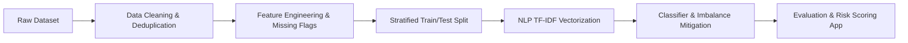

# 🔍 Job Posting Prediction & Fake Job Detection


An end-to-end Machine Learning and Natural Language Processing (NLP) pipeline designed to detect fraudulent job postings, protecting job seekers from recruitment scams, identity theft, and financial fraud.

---

## 📌 Project Overview

Online recruitment fraud is a growing security risk for job seekers worldwide. Scam postings can lead to privacy breaches, fake check scams, and lost time. 

This project analyzes the Kaggle **Real or Fake Job Posting Prediction** dataset, containing **17,880 job postings**. Using textual analysis and binary classification models, we identify key predictive signals (such as missing company profiles, absent logos, and specific phrasing) to automatically flag suspicious recruitment offers.

---

## 📊 Dataset & Key Data Insights

> [!NOTE]
> Due to file size (~50 MB), `fake_job_postings.csv` is excluded from version control via `.gitignore`. Download the dataset directly from [Kaggle](https://www.kaggle.com/datasets/shivamb/real-or-fake-fake-jobposting-prediction?select=fake_job_postings.csv) and place it in the root directory.

### Dataset Overview
* **Total Instances**: 17,880 raw rows $\rightarrow$ **17,599 rows** after removing 281 duplicates.
* **Attributes**: 18 columns (textual descriptions, metadata flags, categorical attributes).
* **Target Variable**: `fraudulent` (`0` = Legitimate, `1` = Fraudulent).
* **Class Imbalance**: Severe imbalance (~19.5:1 ratio):
  * **Legitimate (0)**: 16,743 postings (**95.14%**)
  * **Fraudulent (1)**: 856 postings (**4.86%**)

### 💡 Key Empirical EDA Findings
Exploratory Data Analysis revealed strong behavioral signals that separate legitimate employers from fraudulent actors:

| Indicator / Feature | Legitimate Jobs (0) | Fraudulent Jobs (1) | Insight & Signal |
| :--- | :---: | :---: | :--- |
| **Missing Company Profile** | **16.14%** | **67.76%** | Scammers rarely provide detailed company background information. |
| **Missing Company Logo** | **18.21%** | **67.06%** | Over two-thirds of fake job ads lack a verified company logo. |
| **Missing Screening Questions** | **49.77%** | **70.91%** | Scammers skip standard screening questions to minimize applicant friction. |
| **Telecommuting Flag** | **4.12%** | **7.48%** | Remote job descriptions have a higher proportion of fraudulent listings. |

---

## 🛠️ Tech Stack

* **Language**: Python 3.8+
* **Data Wrangling & Analysis**: `pandas`, `numpy`
* **Machine Learning & NLP**: `scikit-learn` (TF-IDF Vectorization, Logistic Regression, Linear SVM), `xgboost`
* **Data Visualization**: `matplotlib`, `seaborn`
* **Development Environment**: Jupyter Notebook

---

## 🗺️ Modeling Pipeline & Strategy



1. **Deduplication & Cleaning**: Removed 281 duplicate job postings across non-ID attributes to prevent data leakage between train/test splits.
2. **Feature Engineering**:
   - Engineered explicit missingness indicator flags (`company_profile_missing`, `salary_range_missing`, `benefits_missing`, `department_missing`).
   - Combined core textual attributes (`title`, `company_profile`, `description`, `requirements`, `benefits`) into a unified text feature vector.
3. **Stratified Splitting**: Applied stratified partitioning to preserve the 4.86% target fraud ratio across train and test sets.
4. **Text Vectorization & Baseline Model**: Extracted sublinear TF-IDF features coupled with Logistic Regression as an initial baseline.
5. **Class Imbalance Mitigation & Advanced Classifiers**:
   - Incorporated `class_weight='balanced'` and threshold optimization to maximize Precision and Recall.
   - Evaluated Linear SVM and XGBoost classifiers.
6. **Interpretability & Error Analysis**: Extracted high-weight text tokens and metadata flags to score job risk transparently.

---

## 📂 Repository Structure

```
job_posting_prediction/
├── .gitignore                   # Specifies untracked files (dataset, checkpoints, venv)
├── fake_job_postings.csv        # Kaggle dataset (ignored by Git, place locally)
├── job_posting_prediction.ipynb # Interactive notebook (EDA, preprocessing, modeling)
└── README.md                    # Project documentation
```

---

## 🚀 Quick Start

### 1. Clone the Repository
```bash
git clone https://github.com/Med-IDBENOUAKRIM/job_posting_prediction.git
cd job_posting_prediction
```

### 2. Set Up Environment & Install Dependencies
It is recommended to use a virtual environment:
```bash
python -m venv venv
source venv/bin/activate  # On Windows: venv\Scripts\activate
pip install pandas numpy scikit-learn matplotlib seaborn jupyter xgboost
```

### 3. Add Dataset
Download `fake_job_postings.csv` from [Kaggle](https://www.kaggle.com/datasets/shivamb/real-or-fake-fake-jobposting-prediction?select=fake_job_postings.csv) and place it directly inside the project root folder.

### 4. Launch Jupyter Notebook
```bash
jupyter notebook job_posting_prediction.ipynb
```

---

## 📈 Roadmap & Future Work

- [x] Initial EDA, missing value flag engineering, and deduplication
- [ ] Text normalization and TF-IDF pipeline building
- [ ] Baseline Logistic Regression & Linear SVM modeling
- [ ] Threshold tuning & evaluation (ROC-AUC, PR-AUC, F1-score)
- [ ] Interactive **Streamlit** risk-scoring web app prototype
- [ ] Model deployment & cloud hosting
