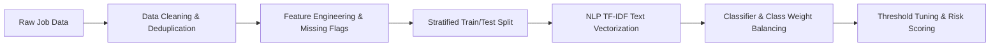

# 🔍 Job Posting Prediction & Fake Job Detection


An end-to-end Machine Learning and Natural Language Processing (NLP) pipeline designed to detect fraudulent job postings, protecting job seekers from recruitment scams, identity theft, and financial fraud.

---

## 📌 Project Overview

Online recruitment fraud is a growing security threat for job seekers worldwide. Fraudulent job listings often serve as fronts for identity theft, fake check scams, phishing, and phishing-for-information schemes.

This project leverages the Kaggle **Real or Fake Job Posting Prediction** dataset (containing **17,880 job postings**) to build an intelligent, data-driven binary classification system. By combining engineered metadata indicators (such as missing company profiles or logos) with NLP TF-IDF text features, our system identifies subtle behavioral signals that separate legitimate employers from fraudulent actors.

---

## 📊 Dataset & Key Data Insights

> [!NOTE]
> Due to file size constraints (~50 MB), `fake_job_postings.csv` is excluded from version control via `.gitignore`. Download the dataset directly from [Kaggle](https://www.kaggle.com/datasets/shivamb/real-or-fake-fake-jobposting-prediction?select=fake_job_postings.csv) and place it in the project root directory.

### Dataset Overview
* **Total Raw Instances**: 17,880 rows
* **Deduplicated Instances**: **17,599 rows** (after removing 281 duplicate job postings across non-ID fields to eliminate data leakage)
* **Attributes**: 18 original columns (textual descriptions, metadata flags, categorical attributes)
* **Target Variable**: `fraudulent` (`0` = Legitimate, `1` = Fraudulent)
* **Class Imbalance**: Severe class imbalance (~19.5 : 1 ratio)
  * **Legitimate Jobs (`0`)**: 16,743 postings (**95.14%**)
  * **Fraudulent Jobs (`1`)**: 856 postings (**4.86%**)

### 💡 Key Empirical EDA Findings
Exploratory Data Analysis revealed strong behavioral signals distinguishing genuine job listings from fraudulent offers:

| Indicator / Feature | Legitimate Jobs (0) | Fraudulent Jobs (1) | Key Predictive Insight & Behavioral Signal |
| :--- | :---: | :---: | :--- |
| **Missing Company Profile** | **16.14%** | **67.76%** | Scammers rarely provide verifiable company background or history. |
| **Missing Company Logo** | **18.21%** | **67.06%** | Over two-thirds of fake listings lack a company logo. |
| **Missing Screening Questions** | **49.77%** | **70.91%** | Fraudulent ads skip standard applicant screening to minimize candidate friction. |
| **Telecommuting Flag** | **4.12%** | **7.48%** | Remote job descriptions carry a significantly higher baseline fraud rate. |

---

## 🛠️ Tech Stack

* **Programming Language**: Python 3.8+
* **Data Wrangling & Analysis**: `pandas`, `numpy`
* **Machine Learning & NLP**: `scikit-learn` (TF-IDF Vectorization, Logistic Regression, Linear SVM), `xgboost`
* **Data Visualization**: `matplotlib`, `seaborn`
* **Development Environment**: Jupyter Notebook

---

## 🗺️ Modeling Pipeline & Strategy



### Stage Breakdown:
1. **Deduplication & Cleaning**: Removed 281 duplicate job postings across non-ID columns to enforce strict independence between training and test sets and prevent data leakage.
2. **Feature Engineering**:
   - Engineered explicit missingness indicator flags (`company_profile_missing`, `salary_range_missing`, `benefits_missing`, `department_missing`).
   - Combined core textual attributes (`title`, `company_profile`, `description`, `requirements`, `benefits`) into a unified text field for vectorization.
3. **Stratified Partitioning**: Applied 80/20 stratified train-test splitting to ensure exact target class ratio distribution (4.86% fraud) in both splits.
4. **NLP Vectorization**: Applied sublinear TF-IDF scaling on unified text corpora to capture key term weightings and n-gram representations.
5. **Imbalance Mitigation & Classification**:
   - Evaluated Logistic Regression, Linear SVM, and XGBoost models.
   - Applied cost-sensitive learning (`class_weight='balanced'`) and decision threshold tuning to maximize Precision, Recall, and PR-AUC.
6. **Interpretability & Risk Scoring**: Analyzed top feature weights and missing flag correlations to score job risk transparently.

---

## 📂 Repository Structure

```
job_posting_prediction/
├── .gitignore                   # Excludes datasets, virtual environments & checkpoints
├── README.md                    # Project documentation
├── requirements.txt             # Project Python dependencies
├── fake_job_postings.csv        # Kaggle dataset (place locally in root directory)
└── job_posting_prediction.ipynb # Interactive notebook (EDA, feature engineering, modeling)
```

---

## 🚀 Quick Start Guide

### 1. Clone the Repository
```bash
git clone https://github.com/devloopcode/job_posting_prediction.git
cd job_posting_prediction
```

### 2. Set Up Virtual Environment & Install Dependencies
```bash
# Create a virtual environment
python3 -m venv venv

# Activate the virtual environment
# On macOS/Linux:
source venv/bin/activate
# On Windows:
# venv\Scripts\activate

# Install required dependencies
pip install -r requirements.txt
```

### 3. Obtain the Dataset
Download `fake_job_postings.csv` from [Kaggle Real or Fake Job Posting Prediction](https://www.kaggle.com/datasets/shivamb/real-or-fake-fake-jobposting-prediction?select=fake_job_postings.csv) and place it directly inside the root `job_posting_prediction/` directory.

### 4. Run the Jupyter Notebook
```bash
jupyter notebook job_posting_prediction.ipynb
```

---

## 📈 Project Roadmap & Milestones

- [x] Initial EDA, missing value flag engineering, and deduplication
- [x] Stratified train/test splitting pipeline design
- [ ] Text normalization, tokenization, and TF-IDF pipeline building
- [ ] Baseline Logistic Regression & Linear SVM model training
- [ ] XGBoost classifier integration & hyperparameter tuning
- [ ] Precision-Recall optimization & decision threshold tuning
- [ ] Feature importance analysis & model interpretability (SHAP/coefficients)
- [ ] Interactive **Streamlit** job ad risk-scoring web app prototype
- [ ] Model serialization & cloud deployment

---

## 📜 License

This project is open-source and available under the [MIT License](LICENSE).

---

## 🤝 Contributing

Contributions, issues, and feature requests are welcome! Feel free to check the [issues page](https://github.com/devloopcode/job_posting_prediction/issues).
